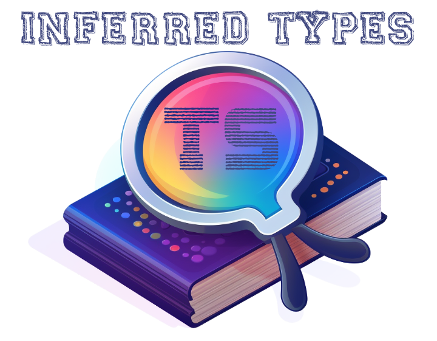

## Overview

A collection of Typescript utilities which try to preserve as much strong and narrow typing as is possible. In many cases, these _type utilities_ will be paired with a runtime function which provides a runtime mirror to help keep both design time types and runtime values in sync.

All types -- as well as any pairing runtime functions -- are intended to be "self documenting" as much as is possible. This means that they will _at least_ have a description comment which your editor should expose as a popover. In some cases, there are also code examples included in these comments to further flesh out intended use.

To keep things DRY, the documentation here will be kept to a minimum. This README is intended more as a high level introduction of scope and structure of this repo than documentation.

## Directory Structure

Under the `src/` folder you'll find the the following subdirectories:

- `constants` - a set of runtime constants that can provide _utility_ to both runtime functions as well as provide foundation for enumerated types.
- `types` - this folder represents the heart of the repo in the form of _type utilities_ and is further broken down by an attempt at functional classification that hopefully aides somewhat in feature discovery.
- `runtime` - this is where you'll find runtime functions which mutate state while taking care to provide as much as type information that compliments the runtime environment as is possible.

## Runtime synchronization with Types

You will find many runtime functions like `ensureleading(str, substring)` which have a similarly named type (in this case `EnsureLeading<TStr, TSubstring>`). This is no accident and at some future point there may even be something approximating 1:1 parity.

This connection between the type system and the runtime environment allows both a harmonization of variables across both environments and helps to ensure their consistency but it the runtime environment also often really needs strong type utilities to extract out narrow type definitions in the runtime environment.

## Examples

What follows is not meant to be comprehensive set of examples but rather just a sampling that hopefully gives some perspective on the breadth of scope of this library.

### String Literals

#### Casing Conventions

- use `PascalCase<T>`, `CamelCase<T>`, `SnakeCase<T>`, and `KebabCase<T>` to convert a string to one of several familiar naming conventions
- use `AllCaps<T>` to make all alphanumeric characters into their uppercase variant

#### Pluralization

Convert the _type_ and _value_ of a variable from it's singular form to it's plural form:

```ts
import { pluralize } from "inferred-types";

// "people"
const people = pluralize("person");
```

> **Note:** not only does this utility provide all major grammatical rules used in conversion but has a dictionary of common exceptions it will use too.

#### Consistency with Ensure/Strip utilities

- it's often desireable to _ensure_ that a string _starts with_ or _ends with_ a given string
- the inverse can also be useful (aka, to _ensure_ a string _does not_ start or end with a given string literal)
- this library provides `EnsureLeading`, `EnsureTrailing`, `StripLeading`, and `StripTrailing` utilities to meet these type needs

  ```ts
  import type { EnsureLeading } from "inferred-types";
  // "start-${string}"
  type T1 = EnsureLeading<string, "start-">;
  // "start-with"
  type T2 = EnsureLeading<"start-with", "start-">;
  // "start-with"
  type T3 = EnsureLeading<"with", "start-">;
  ```

#### Character Sets

- types like `Alpha`, `NumericChar`, `Whitespace`, `Consonants`, etc. try to represent character set building blocks that we may have to isolate on for our own types definitions

#### Data Patterns

- types like `Url`, `IpAddress`, `CSV`, `DotPath`, `Hexadecimal`, `ZipCode`, and `DomainName` attempt to provide an out of the box type for common data structure patterns we find in the real world

### Numeric Literals

- use the `Add<A,B>`, `Subtract<A,B>`, `Increment<T>`, `Decrement<T>` utilities to work with numeric types (or even _numeric_ string literals)
- get the length of a string or tuple with the `Length<T>` utility
- ensure an _integer_ value with `Integer<T>`; ensure a _float_ value with `Float<T>`
- compare numeric literals with `LessThan<A,B>`, `LessThanOrEqual<A,B>`, and `GreaterThan<A,B>`
- ensure a _positive_ number with `Abs<T>`

### Lists

- Use `AfterFirst`, `First`, `Last` to index into a tuple / list value
- Use `AsArray<T>` to ensure an array value for T
- Use `Flatten<T>` to _flatten_ an array
- Use `Slice<T,S,E>` to take out a subset of elements in a list
- Use `Reverse` to reverse a list

### Object / Dictionaries

1. Based on an object's entity values:

    Assume a base type of `Obj`:

    ```ts
    type Obj = {
        n1: number;
        n2: 2;
        n3: 3;
        success: true;
        s1: string;
        s2: "hello";
    }
    ```

    We can get a union of string literals representing the _keys_ on the object whose value _extends_ some value:

    ```ts
    import type { KeysWithValue, KeysWithoutValue } from "inferred-types";
    // "s1" | "s2"
    type S = KeysWithValue<Obj, string>;
    // "success" | "n1" | "n2"
    type N = KeysWithoutValue<Obj, string>;
    ```

    > though less used, you can also use `KeysEqualValue` and `KeysNotEqualValue` for equality matching

    If you'd prefer to mutate the object's type rather than just identify the _keys_ which extend a value you can do this with: `WithValue` and `WithoutValue`:

     ```ts
     import type { WithValue, WithoutValue } from "inferred-types";
     // { s1: string; s2: "hello" }
     type S = WithValue<Obj, string>;
     // { success: true; n1: number; n2: 2; n3: 3 }
     type N = WithoutValue<Obj, string>;
     ```

## Contributing

If you are using this library and would like to take the next step of _contributing_; that effort is welcome but please do make sure to always provide both runtime and type tests for any code changes which you submit as a pull request.

See the plentiful examples that exist under the `tests/` folder for inspiration.

**Note:** as of 2024 I'm also starting to add "type performance" tests; not an absolute requirement but in general adding something like you'll find in the `benches/` folder for any new type utility would be appreciated.

## Licensing

This repo is offered under the highly permissive MIT license.
