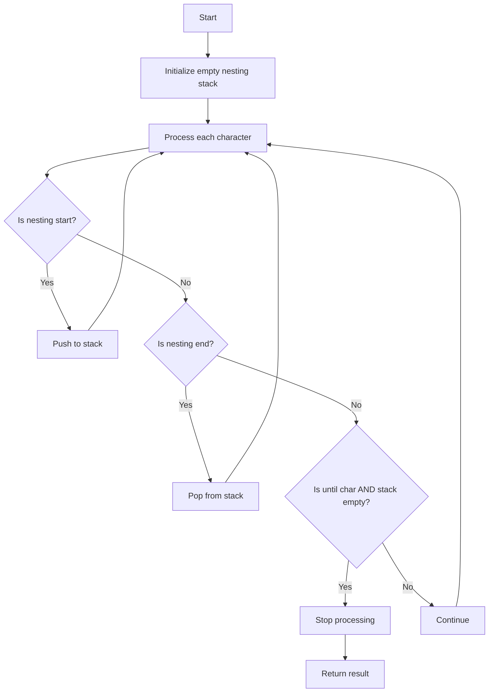

# Implementation Plan: retainUntil__Nested()

## Overview
Implementation plan for the `retainUntil__Nested()` runtime function that combines character matching with nesting awareness to retain string content until a specific character is found at the root nesting level.

## Function Signature

```typescript
export function retainUntil__Nested<
    TContent extends string,
    TUntil extends string,
    TInclude extends boolean = true,
    TNesting extends Nesting = DefaultNesting
>(
    content: TContent,
    until: TUntil,
    include?: TInclude,
    nesting?: TNesting
): RetainUntil__Nested<TContent, TUntil, TInclude, TNesting>
```

## Algorithm Design



## Helper Functions/Utilities

1. `asChars()` - Convert string to character array (already exists)
2. `IsNestingStart<TChar, TNesting>` - Check if character starts nesting (from nesting.ts)
3. `IsNestingEnd<TChar, TNesting>` - Check if character ends nesting (from nesting.ts)
4. `IsNestingMatchEnd<TChar, TStack, TNesting>` - Validate matching end token (from nesting.ts)

## Edge Cases

1. Empty input string
2. Until character not found
3. Unmatched nesting tokens
4. Multiple nesting levels
5. Until character appears inside nested structure
6. Include/exclude the until character (TInclude parameter)

## Unit Test Strategy

### 1. Basic Functionality (no nesting)
```typescript
// Test with and without including the until char
type T1 = RetainUntil__Nested<"hi there", " ", false>; // "hi"
type T2 = RetainUntil__Nested<"hi there", " ", true>;  // "hi "
```

### 2. Single Nesting Level
```typescript
// Function definition with braces
type T1 = RetainUntil__Nested<"function greet() { return; }", "}">;
```

### 3. Multi-level Nesting
```typescript
// Object/array with nested structures
type T1 = RetainUntil__Nested<"[ { foo: { bar: 42 } } ]", "]">;
```

### 4. Custom Nesting Configuration
```typescript
// Using specific nesting pairs
type T1 = RetainUntil__Nested<"<div>content</div>", ">", true, {"<": ">"}>;
```

## Implementation Steps

1. Create basic function structure with parameters
2. Implement character-by-character processing with stack tracking
3. Add nesting token detection and stack management
4. Handle the until character detection at root level
5. Implement include/exclude logic for the until character
6. Add type inference support
7. Add error handling for edge cases
8. Write comprehensive tests
