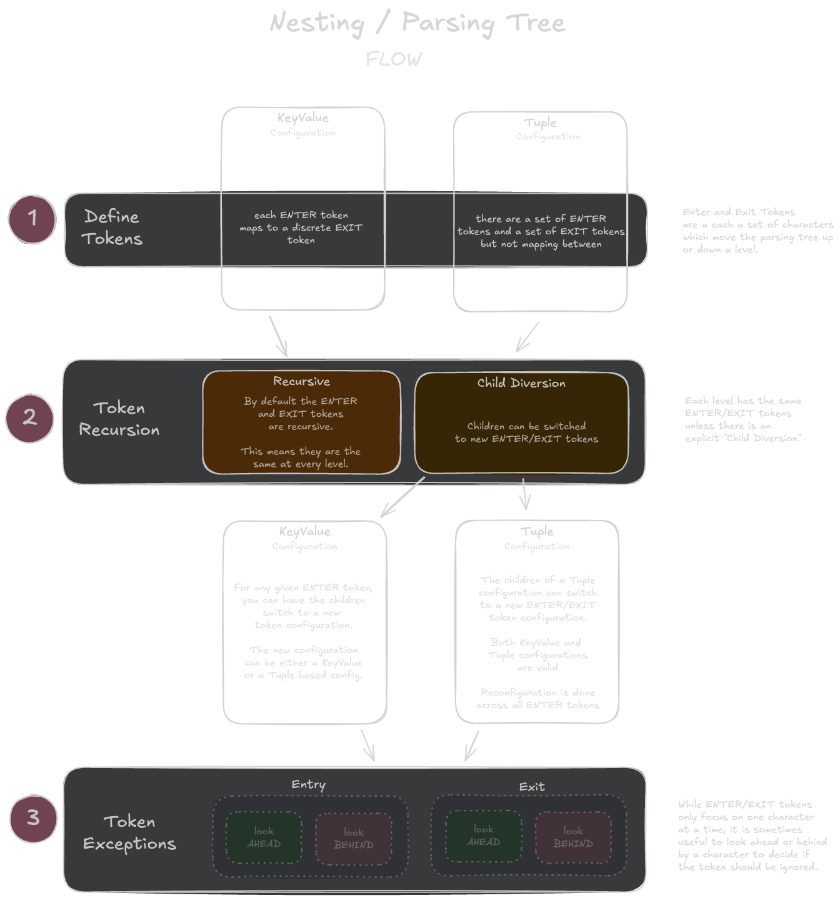
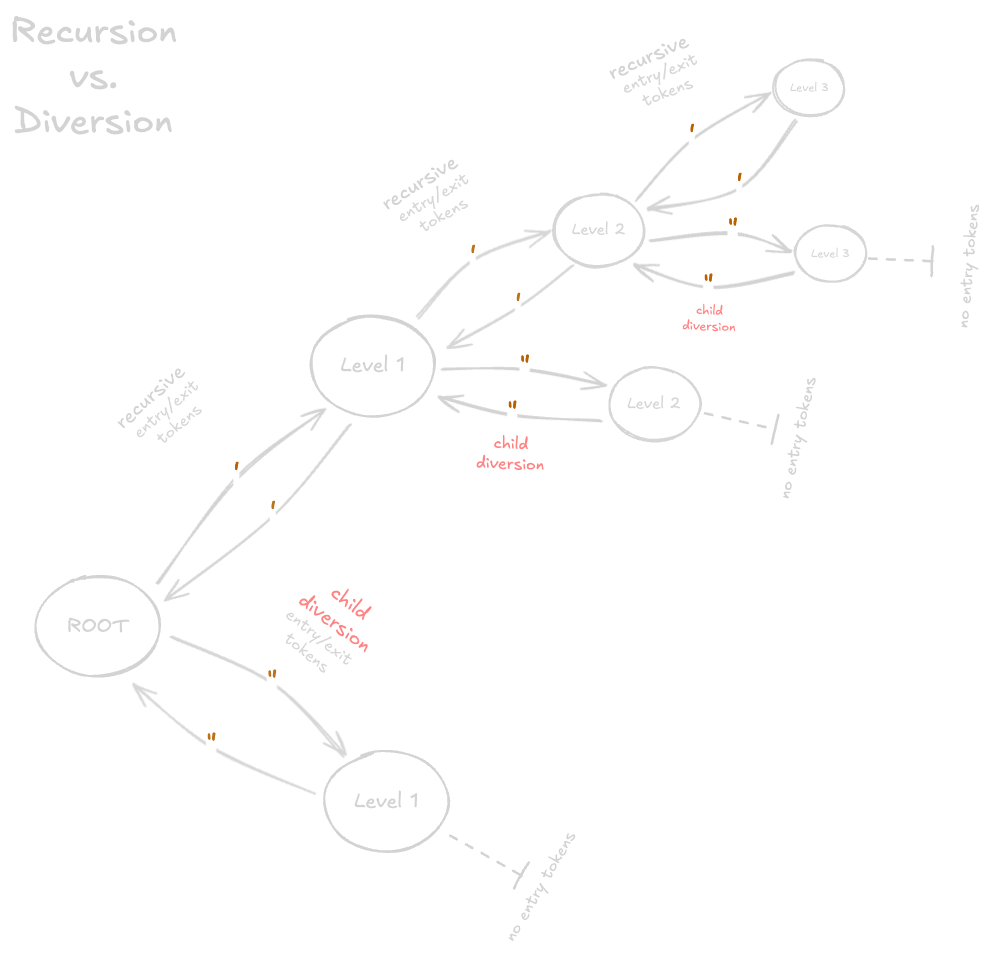

# Nesting and Parsing

The **inferred-types** library provides comprehensive support for parsing and working with nested string structures through a collection of type utilities and runtime functions. This functionality is essential for handling strings that contain hierarchical structures like code, markup, or any text with paired delimiters.

## Overview

Nesting functionality allows you to:

- Parse strings into structured representations that understand nested relationships
- Split strings while respecting nesting boundaries
- Extract substrings up to specific delimiters while maintaining nesting context
- Convert between flat strings and nested data structures

We also use nesting directly in utilities such as:

- `NestedSplit` / `nestedSplit()`
- `RetainUntil__Nested` / `retainUntil__Nested()`
- and the higher order function `nesting()`

Indirectly we rely on nesting/parsing to be able to parse `InputTokens` and many other features. So while we are own _consumer_ of nesting it is also a power set of tools that users of this library can use directly.

## Configuration

### Base Token Configuration

The configuration of nested parsing trees is largely done with two primitives:

1. [`NestingKeyValue`](../modules/types/src/domains/nesting/primitives/NestingKeyValue.ts)

    This configuration primitive is used to define **entry** and **exit** tokens which are mapped together. They are defined as a key-value dictionary where the _keys_ are the **entry** tokens and the _values_ are the **exit** tokens.

    **Example:**

    ```ts
    type Config = As<{
        '(': ')',
        '{': '}',
        '<': '>'
    }, NestingKeyValue>
    ```

2. [`NestingTuple`](../modules/types/src/domains/nesting/primitives/NestingTuple.ts)

    The `NestingTuple` type is also responsible for defining **entry and **exit** tokens but unlike the `NestingKeyValue` the entry and exit tokens are unrelated.

    **Example:**

    ```ts
    type Config = As<{

    }, NestingTuple>
    ```

**Note:** the `Nesting` type is a union of `NestingKeyValue` and `NestingTuple` and represents the two core ways of defining a nesting configuration.

### Understanding what a Entry and Exit token is

A nested tree (or a parsing tree) is a multi-level tree which a string is moved into.

- we start from a ROOT level and parse a string, character by character
- we stay on the ROOT level _until_ we hit an ENTRY token
- once an ENTRY token has been found, we move _up_ a level and keep on parsing character by character looking for either an EXIT token (to go down a level) or another ENTRY token to go up another level
    - as a rudimentary example imagine we're parsing the string `Hello (world)!` and we're using the example configuration provided in the `NestingKeyValue` section
    - we will process characters at the ROOT level until we hit the `(` character
        - at this point we move to Level 1 and we continue processing characters until we hit the `)` character
        - this character is the sole EXIT token for this level and since we've found it we will move back down to the ROOT level
        - now back at the ROOT level we parse the final character (the `!` character) and we're done
    - jobs which are able to end on the ROOT level are considered to have successfully parsed the string
    - in contrast if we end up in a positive (or negative) level we will raise an "unbalanced" error.

### Beyond the Basics

Now that we have an understanding for the basics of configuring a nested parse tree, let's get into two more levels of features that are going to be important for a full featured implementation:

1. Token Recursion versus Diversion

    - the idea here is that as we move up levels in the parse tree, do we keep the same Entry and Exit tokens for each level?
    - the examples we've seen so far, the answer is yes ... each new level takes the configuration of it's parent level
    - however, we will find situations where we need to diverge from the ROOT level configuration

2. Token Exceptions

   - while parsing/lexing through the target string we move character by character
   - all of our decisions so far have been based on the _current character_ and this is generally the pattern we want to follow
   - however, there are times where being able to _look-ahead_ at the next token or _look_behind_ and prior character to make decisions will be helpful
   - the ability to ignore certain entry or exit tokens based on what immediately precedes or follows the current character is what we call exceptions.

The following diagram shows at a high level the basics of entry/exit tokens, diversion, and exceptions:



### Recursion vs Diversion

By default we configure our entry/exit tokens at the ROOT level and each level upward we go we continue to have the same configuration.

Probably the first time this perpetual recursion of configuration became a problem was when we were using a **quotes** based set of rules that looked something like this:

```ts
type Config = {
    `'`: `'`,
    `"`: `"`
}
```

- When using a configuration like this you're trying to isolate quoted text -- both single quoted and double quoted -- as a separate layer in order to isolate it.
- Imagine though we were parsing the following string:
    - `the "person" who had entered "wasn't" the person who left`
- If we were to use fully recursive tokens this would fail to parse with an "unbalanced" error.
- Why?
    - When we hit the first double quote we will move to level 1
    - When we hit the next double quote we will move back to the ROOT level
    - When we hit the next double quote (right before the word `wasn't`) we again move to level 1
    - However, when we hit the apostrophe (aka, a single quote mark) we move to level 3 where the exit token is another single quote
    - There are no more single quotes so we do not finish the parsing back the ROOT level!

We can solve this problem quite easily by expressing that we want to remove all entry/exit tokens when going into the double quote character:

```ts
type Config = {
    `'`: `'`,
    `"`: { exit: `"`, children: {} }
}
```

In this example we see the following:

- the simple key/value structure afforded to us by the `NestingKeyValue` can have a _value_ which is a key/value dictionary itself.
- when we use a dictionary to define the value we _can_ define three things (and must define at least one):
    - `exit`(_required_) - specifies the exit token
    - `children`(_optional_) - allows us to add another `Nesting` configuration for the children of a parent node to take on as their entry/exit tokens.
        - In the example we've used an empty object which means that there are no more entry/exit pairings!
        - That means when we move into Level 1 with the `"` character we will have the exit token of `"` (from ROOT) but there will be no more entry tokens so the tree can not go any deeper.
    - `exceptions`(_optional_) - we didn't set this here and this will be covered in the next section

**Note:** while we didn't explore going down the single quote path, we are still using the default recursive configuration so if we run into a single quote while on the ROOT level we will still have both quote characters as entry tokens and the ability to move deeper into the nested parse tree.

The diagram below tries to show this in a more visual format:




### Exceptions

Now that we've covered Recursion/Diversion let's move onto the third and final part of configuring a nested parse tree: Exceptions.

In this section the example we'll use is in parsing a string that looks like:

- `Array<() => "foo" | "bar">`

Imagine our real needs are to parse any Typescript type. In many cases we might get away with a simple configuration like:

```ts
type Config = {
    `(`: `)`,
    `<`: `>`,
    `'`: `'`,
    `"`: `"`
}
```

The problem we'll run into is that JS/TS arrow functions use the `>` character but are likely NOT the exit token we want to switch on. This is where exceptions come in to save the day.

Let's adjust the configuration only slightly:

```ts
type Config = {
    `(`: `)`,
    `<`: { exit:`>`, exception: { exit: { ignorePrecededBy: "=" } } },
    `'`: `'`,
    `"`: `"`
}
```

Now when we hit the character `>` it will be seen as the _exit_ token but based on the exception and the previous character being `=` it will be passed by and just left as a literal in the level it was in.

#### Exception Syntax

The type [`NestedException`](../modules/types/src/domains/nesting/exceptions/exception-rules.ts) exposes the structure you can configure when using the `exception` property on either a `NestingKeyValue` or `NestingTuple`

### Named Configurations

While it's important that we can define our nesting configurations for our specific needs, there are some configurations which tend to meet the 80/20 rule. We export them as types but also all utilities which use nested configurations allow these named configurations to be used in addition to a custom configuration.

| Type                            | Nickname              | Desc          |
| ---                             | ---                   | ---           |
| [`QuoteNesting`]("../modules/types/src/domains/nesting/named/recursive.ts")                  | `quotes`              | _Recursive_ rule for single and double quotes, and grave markers     |
| [`BracketNesting`]("../modules/types/src/domains/nesting/named/recursive.ts")                | `brackets`            | _Recursive_ rule for square, squiggly brackets and parenthesis      |
| [`BracketAndQuoteNesting`]("../modules/types/src/domains/nesting/named/recursive.ts")        | `brackets-and-quotes` | _Recursive_ rule for both quotes and brackets |
| [`ShallowQuoteNesting`]("../modules/types/src/domains/nesting/named/shallow.ts")           | `shallow-quotes`      | _Root only_ rule for single and double quotes, and grave markers  |
| [`ShallowBracketNesting`]("../modules/types/src/domains/nesting/named/shallow.ts")         | `shallow-brackets`    | _Root only_ rule for square, squiggly brackets and parenthesis |
| [`ShallowBracketAndQuoteNesting`]("../modules/types/src/domains/nesting/named/shallow.ts") | `shallow-brackets-and-quotes` | _Root only_ rule for quotes and brackets |


### Configuring With Runtime

The `createNestingConfig()` function is a simple builder pattern that helps you build valid nesting configurations with type guard rails that ensure you can't really make any mistakes.


## Nesting / Parsing Utilities

To help making utilities like `NestedSplit` / `nestedSplit()` as well as provide uniformity across all the utilities built this repo exposes a number of utilities to make your life better.

| Utility                  | Description               |
| --------                 | ------------              |
| [IsNestingConfig](../modules/types/src/domains/nesting/helpers/IsNestingConfig.ts)`<T>`        | A boolean operator that returns true/false on whether `T` is a valid nesting configuration |
| [IsNestingKeyValue](../modules/types/src/domains/nesting/helpers/IsNestingKeyValue.ts)`<T>`    | A boolean operator that returns true/false based on whether `T` is a valid `NestingKeyValue` config  |
| [IsNestingTuple](../modules/types/src/domains/nesting/helpers/IsNestingTuple.ts)`<T>`    | A boolean operator that returns true/false based on whether `T` is a valid `NestingTuple` config     |
| [IsEntryToken](../modules/types/src/domains/nesting/helpers/IsEntryToken.ts)`<T>`      | Tests the character `T` to see if it is an **entry** token the Nesting configuration. |
| [IsExitToken](../modules/types/src/domains/nesting/helpers/IsExitToken.ts)`<T>`        | Tests the character `T` to see if it is an **exit** token under the Nesting configuration. |
| [GetExitToken](../modules/types/src/domains/nesting/helpers/GetExitToken.ts)`<TEntry, TNesting>`  | Provides the exit token based on the entry token and configuration |
| [GetParentConfig](../modules/types/src/domains/nesting/helpers/GetParentConfig.ts)`<TStack, TNesting>`  | Reconstructs the nesting config that was active when the last entry character (top of stack) was seen |
| [GetNextLevelConfig](../modules/types/src/domains/nesting/helpers/GetNextLevelConfig.ts)`<TEntry, TNesting>`  | Extracts the nesting configuration to use inside a nesting level that starts with `TEntry`|

## Utilities Leveraging Nesting

The following utilities are **direct** beneficiaries of the nesting/parsing features we've discussed in this document:

- `NestedSplit` [ [source](../modules/types/src/string-literals/mutation/NestedSplit.ts), [test](../tests/string-literals/NestedSplit.test.ts) ] _and_  `nestedSplit()` [ [source](../modules/runtime/src/string-literals/split-and-join/nestedSplit.ts), [test](../tests/string-literals/NestedSplit.test.ts) ]
- `RetainUntil__Nested` [ [source](../modules/types/src/string-literals/sub-strings/retain/RetainUntil__Nested.ts), [test](../tests/string-literals/NestedSplit.test.ts) ] _and_ `retainUntil__Nested()` [ [source](../modules/runtime/src/string-literals/sub-string/retain/retainUntil__Nested.ts), [test](../tests/string-literals/NestedSplit.test.ts) ]

### Indirect Beneficiaries

Beyond the utilities above which are _directly built_ with the core nesting/parsing utilities, we also have a long list of utilities which _indirectly_ benefit from these utilities by relying heavily on the utilities above to parse strings:

- **InputTokens**
    - all of the `IT_Take*` parsing utilities found in the [input-tokens](../modules/types/src/runtime-types/type-defn/input-tokens) directory
    - the [`GetInputToken`](../modules/types/src/runtime-types/type-defn/input-tokens/GetInputToken.ts), [`FromInputToken`](../modules/types/src/runtime-types/type-defn/input-tokens/FromInputToken.ts), utilities and more.

**Note:** if you're doing work on the core _nesting_ functionality you MUST test the direct utilities using them (listed in prior section) and before you finish you should also test these indirect dependencies. The command `pnpm typed nesting NestedSplit RetainUntil__Nested input-tokens` will test all of the type tests which are most likely to be impacted.


