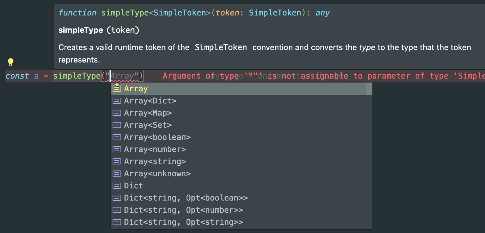
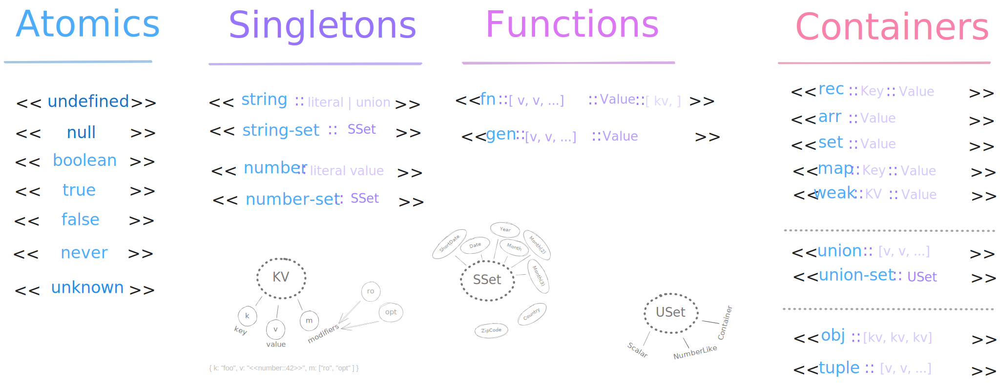

# Runtime Type Definitions

## Lifecycle of a Runtime Type Definition

There are a number of _runtime_ utilities included that help you to define a "type" along with some _types_ you might be interested too.

As a simple example, let's consider the `DefineObject` type:

- this type expresses a dictionary structure where the _values_ are either a "token" representing a type or a callback function that returns a type:

    ```ts
    import { DefineObject } from "inferred-types";
    const defn: DefineObject = {
      foo: "string",
      bar: "number"
    };
    ```

- the above is a valid `DefineObject` definition but this is probably not how we should define this, instead we'll lean on the `defineObject()` function:

    ```ts
    import { DefineObject } from "inferred-types";
    const defn = defineObject({
      foo: "string",
      bar: "number",
      baz: t => t.string().endsWith("baz")
    })
    ```

### Benefits of Runtime Type Definition

- by defining our type through a function we get a large number of benefits:
  - first of all the types are all known and _inferrable_
    - this means the tokens such as "string" or "number" are already known and are autocompleted
    - the callback function is also recognized and fully autocompletable
  - also as may _or may not_ be expected, the function is able to convert the **type** of the return value not to some _definition_ type but the type itself.
  - hover your mouse over `defn` and you'll find the type is:

      ```ts
      { foo: string; bar: number; baz: `${string}baz` }
      ```

### The TYPE is greater than the VALUE

It's important to note that _types_ are more expressive than _values_ because they describe shapes and patterns rather than just one boring instance of the pattern. That realization points to quandry, if the runtime system can not fully express a type then what is our `defn` variable at runtime?

### Runtime Tokens

Well in this case, the runtime representation of `defn` would be:

```ts
{
  foo: "string",
  bar: "number",
  baz: "<<string-set::endsWith::baz>>"
}
```

You might not be surprised by the runtime values of `foo` and `bar` as that's exactly what you typed while defining those props but what on gods green earth is `baz`? Well the fundamental design goal for any runtime type definition is that is that the runtime reprentation can _always_ be convert to its reference type.

So while `foo` and `bar` were defined with what we call `SimpleToken`'s, the definition of `baz` used a callback mechanism that is highly dependant on knowledge of the type system (and hard to preserve as runtime value).

Fortunately, _any type_ which can be returned using our callback surface can be represented by a more complete token system called `TypeToken`'s. Chevy Chase was wrong in **Fletch** when he said it's "all ball bearings these days" ... it's all "tokens".

## Simple Tokens

The `SimpleToken`'s we've seen so far include some pretty simple ones:

- `string` - a _string_ type
- `Opt<number>` - an _optional number_ type (aka, `number | undefined`)

And when simple tokens first started, they were all simple but nowadays these simple tokens just don't know their origin story anymore. Lots of more elaborate types _can_ be represented through a hopefully friendly and intutive syntax. For instance:

- `string(foo,bar,baz)`  creates the union type `"foo" | "bar" | "baz"`
- `number(1,2,3)` creates a numeric union type `1 | 2 | 3`

To aid in understanding/using these tokens you'll want to use runtime utilities like `defineObject()` or `simpleType()` which run through a function and can provide a lot of "autocomplete" assistance:



Truth be told though, if you're wanting to define a more complex type then you should really be using the `TypeToken`'s mentioned previously and the `ShapeApi` / `ShapeCallback` types to provide the callback definitions.

## Type Tokens

`TypeToken`'s  are `SimpleToken`'s big brother and their design goal is to provide a simple string based token that can represent any type from simple to complex. The image below convey's the structural dimensions of the token:



The blue text inside the `<<` and `>>` brackets represent the major _variant_ category defined by the type `TypeTokenKind` (e.g., `string`, `fn`, `set`, etc.).

So as a _for instance_, in our example at the start of this section we defined a string literal type which _ends_ in the string "baz". This translated into the the token `<<string-set::endsWith::baz>>`. From this the following observations can be made:

- all tokens start and end with `<<` and `>>` respectively
- this token is part of the `string-set` variant group
- the `::` characters are the macro delimiter
- moving from left to right will always move from more general to more specific

You'll also notice broad groups such as `Atomics`, `Singletons`, etc. which help to group these variants into categories which have structural similarities.

### The `TypeToken` Utility

The `TypeToken<T>` utility provides us a way to get various levels of detail on the valid types
of a type token.

- When using `TypeToken` without **T** we get a general shape that looks like this:

  ```ts
  `<<${Atomics}>>` | `<<${NonAtomics}>>` | `<<${NonAtomics}::${string}>> | `<<${Set}::${string}>>`
  ```

  - variants under the **Atomics** category are distinguished by only having a single type and therefore will never use `::` delimiters to narrow the type.
  - most of the other variants can define a type _stand-alone_ but also offer sub-variants which further narrow the scope of the type being defined.
  - the one exception are those with the postfix `-set` (e.g., `string-set`, `union-set`, etc.); these must always include a sub-varient name to be meaningful.

Should we want to drill down on types we can do so with two types of granularity:

- Variant Specific: `TypeToken<string>` or `TypeToken<fn>`
- Category Type: `TypeToken<atomics>` or `TypeToken<containers>`

In both cases, the precision of the type will now be made more granual accounting for the various sub-variant options.

### The `createTypeToken()` Utility

In the runtime system, you are also provided `createTypeToken()` utility which provides a type-safe way of creating a token.

```ts
// `<<string-set::endsWith::foo>>`
const endsWithFoo = createTypeToken("string-set")("endsWith")("foo");
// null
const nada = createTypeToken("null");
```

Note that this is just a tool for creating a string literal token and it does not convert the _type_ to the token's reference type.

## From Token to Type

In our early example we discussed how any runtime type definition -- by design -- must be able to be converted, and reconverted again, to the _type_ it represents.

In this same example, we said that the `defineObject` utility produces a runtime of `DefineObject` but transforms the type for you to the type which is _defining_. This is convenience because most of the time this is what you want but more importantly, how did it actually convert a "token definition" to a "type" and how can we take the raw `DefineObject` and convert it later?

### The `FromDefn` Utility

The simplist and most capable answer on how to convert from token-to-type is using the `FromDefn` utility. This utility knows about many definition formats and will detect what definition type is being passed to it and convert it. This includes `DefineObject` definitions but also includes raw `SimpleToken` values or raw `TypeToken` values too:

```ts
// the token represention of a DefinObject
type BeginWithFoo = { foo: "<<string-set::startsWith::foo>>"; bar: "number" };
// { foo: `foo${string}`; bar: number }
type TranslatesTo = FromDefn<BeginWithFoo>;
```

This shows how, in the type system, we can do the conversion and in the runtime system, we have the `fromDefn()` function which performs similar duties.


